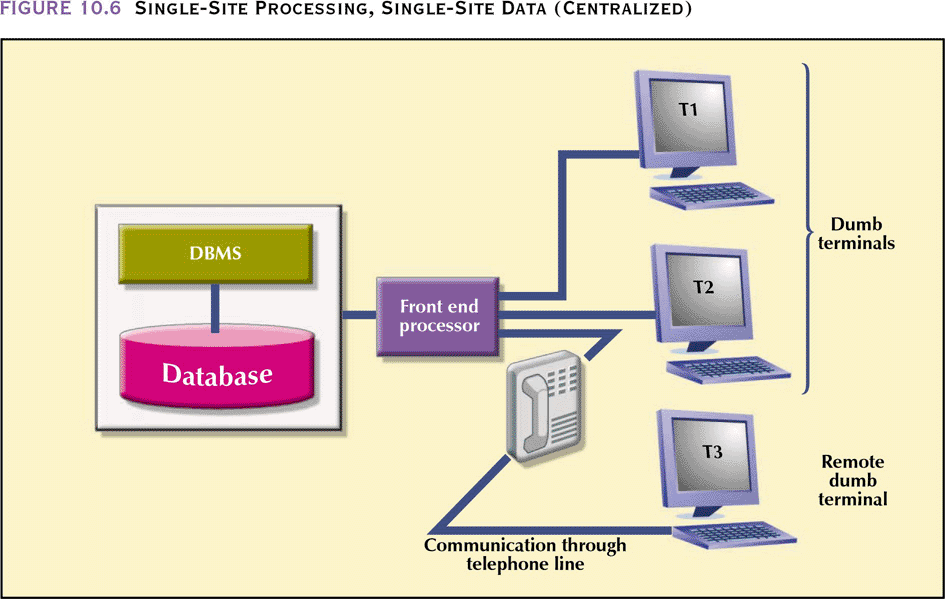
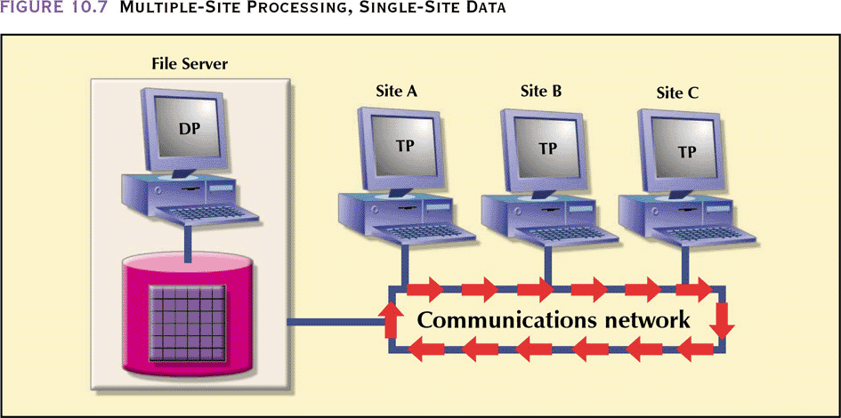

# Distributed SQL Database
----

Distributed databases can exist in two main modes:
1. Distributed Processing: splitting the data generation across multiple machine but data is centralized
2. Distributed Storage: splitting the data storage across multiple machines

A database can be built using a combination of the above to give varying degrees of distribution.

## Single-Site Processing, Single-Site Data (SPSD)
A non distributed database, that is typically found in most SQL servers. All processing is done on single CPU or host computer and all data is stored on host computer’s local disk Processing cannot be done on end user’s side of the system and data can be accessed remotely.

## Multiple-Site Processing, Single-Site Data (MPSD)

Commonly found on network connected databases, multiple processes run on different computers sharing a single data repository. All record and file locking activity occurs at the end-user location, all data selection, search and update functions takes place at the workstation. This requires entire files to travel through the network for processing at the workstation. This increases network traffic, slows response time and increases communication costs. To perform SELECT that results in 50 rows, a 10,000 row table must travel over the network to the end-user. A variation of MPSD known as client/server architecture, all processing occurs at the server site, reducing the network traffic, the processing is distributed; data can be located at multiple sites.

## Multiple-Site Processing, Multiple-Site Data (MPMD)

Fully distributed database management system with support for multiple data processors and transaction processors at multiple sites. This type can be classified as:
- Homogeneous: integrates only one type of centralized DBMS over a network, the same DBMS will be running on different machines
- Heterogeneous: integrates different types of centralized DBMSs over a network, fully heterogeneous DDBMS support different DBMSs that may even support different data models (relational, hierarchical, or network) running under different machines

No database currently provides full support for heterogeneous or fully heterogeneous systems.

## Data Fragmentation
To support distribution of SQL databases, the data needs to be fragmented since most SQL servers are designed to run as a standalone server, therefore the operations need to be abstracted to be able to handle multiple servers. There are two ways to fragment the data on multiple servers.

### Horizontal Fragmentation:
Tables are split on the row level, for instance:

| id    | first_name | last_name | location | last_login |
| :---- | :--------- | :-------- | -------- | ---------- |
| 1     | John       | Smith     | New York | 2018-9-1   |
| 2     | Sarah      | Carter    | New York | 2018-12-1  |
| ...   | ...        | ...       | ...      | ...        |
| 10000 | Sam        | Dean      | Houston  | 2017-9-1   |

would be split on two servers depending on a criteria, for instance the location to be:

#### Server 1

| id   | first_name | last_name | location | last_login |
| :--- | :--------- | :-------- | -------- | :--------- |
| 1    | John       | Smith     | New York | 2018-9-1   |
| 2    | Sarah      | Carter    | New York | 2018-12-1  |
| ...  | ...        | ...       | ...      | ...        |

#### Server 2

| id    | first_name | last_name | location | last_login |
| :---- | :--------- | :-------- | -------- | :--------- |
| 900   | Jade       | Connor    | Houston  | 2019-1-1   |
| ...   | ...        | ...       | ...      | ...        |
| 10000 | Sam        | Dean      | Houston  | 2017-9-1   |

Advantages of horizontal fragmentation:
- Allows parallel processing on fragments of a relation
- Allows a relation to be split so that tuples are located where they are most frequently accessed

### Vertical Fragmentation

Tables are split up on the column level for instance:

| id   | name   | location | limit | balance | rating | amount_due |
| :--- | :----- | :------- | :---- | :------ | :----- | :--------- |
| 1    | Intel  | USA      | 5000  | 3000    | 3      | 1200       |
| 2    | AMD    | USA      | 7000  | 5000    | 3      | 2000       |
| 3    | IBM    | USA      | 5000  | 3000    | 2      | 200        |
| 4    | Oracle | USA      | 3000  | 1000    | 2      | 100        |
| 5    | HP     | GER      | 2000  | 0       | 1      | 2000       |

would be split up on two servers, depending on a criteria for instance, the most commonly used fields as follows:

#### Server 1

| id   | name   | location |
| :--- | :----- | :------- |
| 1    | Intel  | USA      |
| 2    | AMD    | USA      |
| 3    | IBM    | USA      |
| 4    | Oracle | USA      |
| 5    | HP     | GER      |

#### Server 2

| id   | limit | balance | rating | amount_due |
| :--- | :---- | :------ | :----- | :--------- |
| 1    | 5000  | 3000    | 3      | 1200       |
| 2    | 7000  | 5000    | 3      | 2000       |
| 3    | 5000  | 3000    | 2      | 200        |
| 4    | 3000  | 1000    | 2      | 100        |
| 5    | 2000  | 0       | 1      | 2000       |

Advantages of vertical partitioning:
- Reduces I/O by allowing tuples to be split so that each part of the tuple is stored where it is most frequently accessed, therefore less data is fetched overall
- ID attribute allows efficient joining of vertical fragments
- Allows parallel processing on a relation

Vertical and horizontal fragmentation can be mixed in a database depending on the use case.

-----
## Designing a distributed database

### Transparency
The distributed database, must act as if it is one centralized database, by abstracting much of the internals from the user. This could be usually done by a distributed data dictionary, which contains the description of the entire database as seen by the database administrator. The dictionary is itself distributed and replicated at the network nodes to avoid single point of failures.

Three levels of distribution transparency are recognized:
1. Fragmentation transparency – user does not need to know if a database is partitioned; the internal fragment names and/or fragment locations are not needed
2. Location transparency – fragment name is required but not location
3. Local mapping transparency – user must specify fragment name and location

There is also a criteria for naming data:
1.  Every data item must have a system-wide unique name
2.  It should be possible to find the location of data items efficiently
3.  It should be possible to change the location of data items transparently
4.  Each site should be able to create new data items autonomously

### Concurrency
Multiple-site operations are much more likely to create data inconsistencies and deadlocked transactions than single-site systems. The transaction protocol component of a database must ensure that all parts of the transaction, at all sites, are completed before a final `COMMIT` is issued to record the transaction. Certain procedures must be taken to ensure transaction coherency:

| Transaction Manager | Transaction Coordinator     |
| :------------- | :------------- |
| Each site has one      | Each site has one       |
|Maintains a log for recovery purposes| Starts the execution of transactions that originate at the site |
|Participates in coordinating the concurrent execution of the transactions executing at that site| Distributes  sub-transactions at appropriate sites for execution |
||Coordinates the termination of each transaction that originates at the site, which may result in the transaction being committed at all sites or aborted at all sites|

### Replication
There needs to be some form of replication to allow for a distributed database to be created. There are multiple forms of replications:

| Type                 | Description                                                  |
| :------------------- | :----------------------------------------------------------- |
| Fully replicated     | Stores multiple copies of each database fragment at multiple sites but can be impractical due to amount of overhead |
| Partially replicated | Stores multiple copies of some database fragments at multiple sites. Most distributed databased are able to handle the partially replicated database well and this is the most commonly used |
| Unreplicated         | Stores each database fragment at a single site               |

Database size, usage frequency and costs (performance, overhead, management) influence the decision to replicate

### C. J. Date’s Twelve Commandments for Distributed Databases
1. Local site independence
2. Central site independence
3. Failure independence
4. Location transparency
5. Fragmentation transparency
6. Replication transparency
7. Distributed query processing
8. Distributed transaction processing
9. Hardware independence
10. Operating system independence
11. Network independence
12. Database independence
