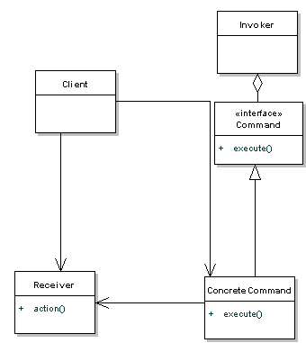

# Backend

------


## RabbitMQ

Message queues serve as a buffers for requests between applications. RabbitMQ is a messaging queue written in Erlang, a language created for scalable, distributed, fault-tolerant systems and soft-realtime systems.  There are three categroies of realtime applications:
- Hard: missing a deadline is a total system failure
- Firm: infrequent deadline misses are tolerable, but may degrade the system's quality of service. The usefulness of a result is zero after its deadline]
- Soft: the usefulness of a result degrades after its deadline, thereby degrading the system's quality of service


RabbitMQ comes packaged with a plugin manager, for instance to enable the web interface (any shell command starting # requires `sudo` or `root` privilege)

```sh
#: rabbitmq-plugins enable rabbitmq_management
```

The interface is now running at (http://localhost:15672), the default username and password are both *guest*.

### Sender-Receiver

A basic setup is as follows:

#### Send

```java
package RabbitMQ;

import com.rabbitmq.client.Channel;
import com.rabbitmq.client.Connection;
import com.rabbitmq.client.ConnectionFactory;

public class Send {

  private final static String QUEUE_NAME = "hello";

  public static void main(String[] argv) throws Exception {
    ConnectionFactory factory = new ConnectionFactory();
    factory.setHost("localhost");
    Connection connection = factory.newConnection();
    Channel channel = connection.createChannel();

    channel.queueDeclare(QUEUE_NAME, false, false, false, null);
    String message = "Hello World!";
    channel.basicPublish("", QUEUE_NAME, null, message.getBytes("UTF-8"));
    System.out.println(" [x] Sent '" + message + "'");

    channel.close();
    connection.close();
  }
}
```

#### Receive

```java
package RabbitMQ;

import com.rabbitmq.client.*;

import java.io.IOException;

public class Recv {

  private final static String QUEUE_NAME = "hello";

  public static void main(String[] argv) throws Exception {
    ConnectionFactory factory = new ConnectionFactory();
    factory.setHost("localhost");
    Connection connection = factory.newConnection();
    Channel channel = connection.createChannel();

    channel.queueDeclare(QUEUE_NAME, false, false, false, null);
    System.out.println(" [*] Waiting for messages. To exit press CTRL+C");

    Consumer consumer = new DefaultConsumer(channel) {
      @Override
      public void handleDelivery(String consumerTag, Envelope envelope, AMQP.BasicProperties properties, byte[] body)
          throws IOException {
        String message = new String(body, "UTF-8");
        System.out.println(" [x] Received '" + message + "'");
      }
    };
    channel.basicConsume(QUEUE_NAME, true, consumer);
  }
}
```

### Correlation ID

In the case that there are multiple clients connecting to the queue, an ID must be assigned to each request to ensure that each request is sent back to the correct client. This can be done through the use of a correlation ID:

#### Server
```java
Consumer consumer = new DefaultConsumer(channel) {

  @Override
    public void handleDelivery(String consumerTag,
                               Envelope envelope,
                               AMQP.BasicProperties properties,
                               byte[] body) throws IOException {

        AMQP.BasicProperties replyProps = new AMQP.BasicProperties
                            .Builder()
                            .correlationId(properties.getCorrelationId())
                            .build();

        System.out.println("Responding to corrID: "+
                           properties.getCorrelationId());

        String response = "";

        try {
            String message = new String(body, "UTF-8");
            int n = Integer.parseInt(message);

            System.out.println(" [.] fib(" + message + ")");
            response += fib(n);
        } catch (RuntimeException e) {
            System.out.println(" [.] " + e.toString());
        } finally {
            channel.basicPublish("", properties.getReplyTo(), replyProps, response.getBytes("UTF-8"));
            channel.basicAck(envelope.getDeliveryTag(), false);
         // RabbitMq consumer worker thread notifies the RPC server owner thread
            synchronized (this) {
                this.notify();
            }
        }
    }
};
```

#### Client

```java
String corrId = UUID.randomUUID().toString();
System.out.println(corrId);
AMQP.BasicProperties props = new AMQP.BasicProperties
                                     .Builder()
                                     .correlationId(corrId)
                                     .replyTo(replyQueueName)
                                     .build();

channel.basicPublish("",
                     requestQueueName,
                     props,
                     message.getBytes("UTF-8"));

final BlockingQueue<String> response = new ArrayBlockingQueue<String>(1);

channel.basicConsume(replyQueueName, true, new DefaultConsumer(channel) {

@Override
public void handleDelivery(String consumerTag,
                           Envelope envelope,
                           AMQP.BasicProperties properties,
                           byte[] body) throws IOException {

    if (properties.getCorrelationId().equals(corrId)) {
        response.offer(new String(body, "UTF-8"));
    }
 }
```

### Acknowledgements
By default RabbitMQ leaves message acknowledgements to the developer to handle, this is to allow the server to remove the message from its queues once it is sure that it has been received and handled by the client. The following line of code handles that:
```java
channel.basicAck(envelope.getDeliveryTag(), false);
```
If an acknowledgement has not been received it will stay in the server and will be sent again to the worker.

### Publish-Subcribe
To send one message to multiple listening parties, a Publish-Subscribe model needs to be utilized.

#### Publisher

``` java
package PublishSubscribe;

import com.rabbitmq.client.BuiltinExchangeType;
import com.rabbitmq.client.ConnectionFactory;
import com.rabbitmq.client.Connection;
import com.rabbitmq.client.Channel;

public class EmitLog {

  private static final String EXCHANGE_NAME = "logs";

  public static void main(String[] argv) throws Exception {
    ConnectionFactory factory = new ConnectionFactory();
    factory.setHost("localhost");
    Connection connection = factory.newConnection();
    Channel channel = connection.createChannel();

    channel.exchangeDeclare(EXCHANGE_NAME, BuiltinExchangeType.FANOUT);

    String message = getMessage(argv);

    channel.basicPublish(EXCHANGE_NAME, "", null, message.getBytes("UTF-8"));
    System.out.println(" [x] Sent '" + message + "'");

    channel.close();
    connection.close();
  }

  private static String getMessage(String[] strings){
    if (strings.length < 1)
    	    return "info: Hello World!";
    return joinStrings(strings, " ");
  }

  private static String joinStrings(String[] strings, String delimiter) {
    int length = strings.length;
    if (length == 0) return "";
    StringBuilder words = new StringBuilder(strings[0]);
    for (int i = 1; i < length; i++) {
        words.append(delimiter).append(strings[i]);
    }
    return words.toString();
  }
}
```


#### Subscriber
```java
package PublishSubscribe;

import com.rabbitmq.client.*;

import java.io.IOException;

public class ReceiveLogs {
  private static final String EXCHANGE_NAME = "logs";

  public static void main(String[] argv) throws Exception {
    ConnectionFactory factory = new ConnectionFactory();
    factory.setHost("localhost");
    Connection connection = factory.newConnection();
    Channel channel = connection.createChannel();

    channel.exchangeDeclare(EXCHANGE_NAME, BuiltinExchangeType.FANOUT);
    String queueName = channel.queueDeclare().getQueue();
    channel.queueBind(queueName, EXCHANGE_NAME, "");

    System.out.println(" [*] Waiting for messages. To exit press CTRL+C");

    Consumer consumer = new DefaultConsumer(channel) {
      @Override
      public void handleDelivery(String consumerTag, Envelope envelope,
                                 AMQP.BasicProperties properties, byte[] body) throws IOException {
        String message = new String(body, "UTF-8");
        System.out.println(" [x] Received '" + message + "'");
      }
    };
    channel.basicConsume(queueName, true, consumer);
  }
}
```


-----

## Java Reflection

Reflection is the use of introspection to generate dynamic abstract code.

### Command Pattern

Command pattern is a data driven design pattern. A request is wrapped under an object as command and passed to invoker object. Invoker object looks for the appropriate object which can handle this command and passes the command to the corresponding object which executes the command.



The Command Pattern is useful when:
- A history of requests is needed
- You need callback functionality
- Requests need to be handled at variant times or in variant orders
- The invoker should be decoupled from the object handling the invocation

-----

## Extra Reading

### Actor Model

This is a programming paradigm in which a system is compromised of actors. Actors are the smallest units of computation, they can:

1. Send and receive messages
2. Maintain a private state not shared by others
3. Act independently isolated from other actors

Actors can run concurrently but not necessarily in parallel, to explain the difference between concurrent and parallel we take a look at an analogy:

We wish to build two walls opposite each other,  there is a pile of bricks and the bricks need to be carried each time you move build the wall. The *serial* solution would be to build one wall, then after finishing the wall, build the other wall. The *concurrent* solution would be to divide the wall into columns, and lay one column on each side, each time you carry the bricks to avoid repeated trips to the bricks pile. The *parallel* solution would be to hire **an extra** worker so that both of them build at the same time, however this will incur more resources to be used (paying another worker in this instance).

For an actor to run in parallel on the same message, they both need to receive the same message.


### Beam VM

The Beam VM used by Erlang is not a virtual machine in the typical virtual machine sense, in other words typically virtual machines abstract the hardware layer by mapping calls from the program to the instruction set of the supporting hardware. For example, if Java was running on an x86 machine, it would map the instructions from the byte class file into actual x86 hardware instructions, if it runs on ARM architecture, it would be mapping to ARM instructions. Beam VM uses the actor model and uses processes instead of thread. Internally Beam VM spawns a process as an actor instead of a thread such it can more easily monitor and schedule the process than a thread, as each process has a unique name, it additionally enforces that processes only communicate through message passing with each other such that if a process has failed, it can roll back to the private state it held, or be completely restarted, depending on the scenario without affecting the entire system. Processes inside the Beam VM are very lightweight and do not incur significant overhead while creating them. 

Beam VM is used in highly scalable applications (it mostly used in mobile communication systems and banking) as its "let it fail" approach allows for faster recovery of data rather than forcing the programmer to think of all possible scenarios where an application can fail and handle it in the code.


